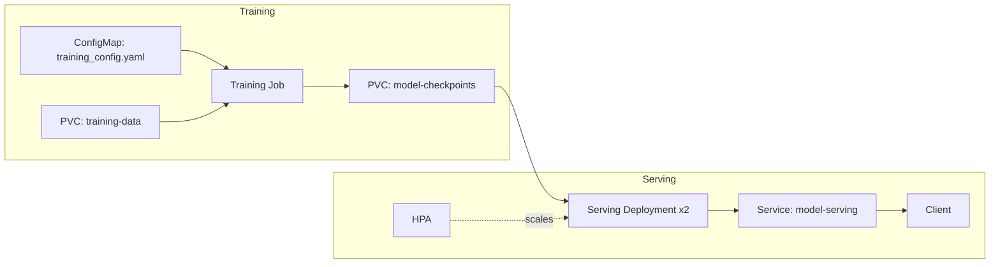

# mlops-pytorch-pipeline

A PyTorch image classifier for CIFAR-10, taken through the full deployment lifecycle: local training, Docker containerization, and Kubernetes deployment.

## Architecture



Training runs as a Kubernetes Job. It reads hyperparameters from a ConfigMap, reads data from a PersistentVolumeClaim, and writes a model checkpoint to a second PersistentVolumeClaim. The serving Deployment mounts that same checkpoint volume read-only and exposes predictions through a Service, with an HPA scaling replicas on CPU load.

## Project layout

```
mlops-pytorch-pipeline/
├── src/               # model, dataset, training loop, serving app
├── configs/           # training hyperparameters
├── docker/            # training and serving Dockerfiles
├── k8s/               # Kubernetes manifests
├── requirements/      # pinned dependencies for train and serve
└── tests/             # unit tests
```

## Local development

Requires Python 3.10+.

```bash
pip install -r requirements/train.txt
python src/train.py
```

By default, `src/train.py` reads `configs/training_config.yaml`. Set `CONFIG_PATH` to point at a different file, or run inside a container where the config is mounted at `/app/configs/training_config.yaml`.

Run the unit tests:

```bash
pip install pytest
pytest tests/
```

Run the serving app:

```bash
pip install -r requirements/serve.txt
uvicorn src.serve:app --host 0.0.0.0 --port 8080
```

## Docker

Build and run the training image:

```bash
docker build -f docker/Dockerfile.train -t mlops-train:v1 .

docker run --rm \
  -v $(pwd)/data:/app/data \
  -v $(pwd)/checkpoints:/app/checkpoints \
  mlops-train:v1
```

Build and run the serving image:

```bash
docker build -f docker/Dockerfile.serve -t mlops-serve:v1 .

docker run --rm -p 8080:8080 \
  -v $(pwd)/checkpoints:/app/checkpoints \
  mlops-serve:v1
```

Test the endpoints:

```bash
curl http://localhost:8080/health

curl -X POST http://localhost:8080/predict \
  -F "image=@test_image.png"
```

## Kubernetes

Apply the manifests in order:

```bash
kubectl apply -f k8s/namespace.yaml
kubectl apply -f k8s/configmap.yaml
kubectl apply -f k8s/training-job.yaml
```

Wait for the training Job to complete, then deploy serving:

```bash
kubectl apply -f k8s/serving-deployment.yaml
kubectl apply -f k8s/serving-service.yaml
kubectl apply -f k8s/hpa.yaml
```

Check status:

```bash
kubectl get pods -n ml-training
kubectl describe deployment model-serving -n ml-training
```

Reach the service locally:

```bash
kubectl port-forward svc/model-serving 8080:80 -n ml-training
curl -X POST http://localhost:8080/predict -F "image=@test_image.png"
```

For a GPU node pool, use `k8s/training-job-gpu.yaml` instead of `k8s/training-job.yaml`. It adds a GPU resource request, a node selector, and a toleration for GPU nodes.

## Git workflow

Work happens on `feature/*` branches created off `develop`, merged in through pull requests. `develop` is merged into `main` once a set of features is validated end to end.
